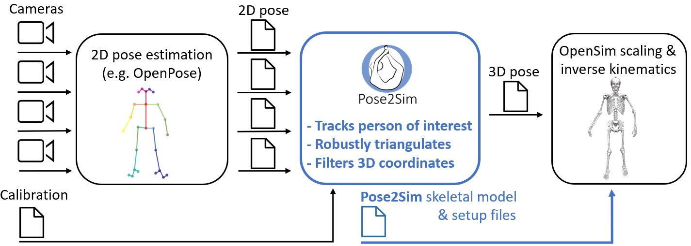

# Pose2Sim


## 설치 

1. **Install OpenPose** (instructions [there](https://github.com/CMU-Perceptual-Computing-Lab/openpose/blob/master/doc/installation/0_index.md)). \
- *Windows portable demo is enough.*\
- *Download BODY25B caffe model (see [there](https://github.com/CMU-Perceptual-Computing-Lab/openpose_train/tree/master/experimental_models#body_25b-model---option-1-maximum-accuracy-less-speed))* 
    - *copy `openpose/getBody25bModel.bat` to `{openpose_root}/models` and run bat file* 
2. **Install OpenSim 4.x** ([there](https://simtk.org/frs/index.php?group_id=91)). \
- *Tested up to v4.4-beta on Windows. Has to be compiled from source on Linux (see [there](https://simtk-confluence.stanford.edu:8443/display/OpenSim/Linux+Support)).*
3. ***Optional.*** *Install Anaconda or [Miniconda](https://docs.conda.io/en/latest/miniconda.html). \
   - *Open an Anaconda terminal and create a virtual environment with typing:*
   ```
   conda create -n Pose2Sim python=3.7 
   conda activate Pose2Sim
    ```
4. **Install requirements** 
   ```
   pip install -r requirements.txt
    ```

## 실행

### 1. 영상 파일 옮기기 및 환경 파일 수정

- 최초 폴더 구조는 아래와 같아야 함. 
```
data/{project name}
├── calib-2d
│   ├── cam0
│   │   └── {calib_cam0}.avi  
│   └── cam1
│       └── {calib_cam1}.avi   
└── raw-2d
    ├── {sequence name1}
    │   ├── cam0
    │   │   └── {seq_cam0}.avi  
    │   └── cam1
    │       └── {seq_cam1}.avi
    ├── {sequence name2}
    └── ...
```
- Config.toml을 열어 아래 경로들을 수정. 
```
[project]
project_dir = './data/230512_swing_45deg' # 프로젝트 파일 경로
motion_name = 'swing1' # 시퀀스 이름 
[openpose]
openpose_path = {openpose_root} # 오픈포즈가 설치된 경로
[calibration] # 체커보드 캘리브레이션 파라미터
```

### 2. 캘리브레이션 및 3차원 관절 추출(.TRC) 추출  
- 아래 스크립트 실행하여 TRC 파일 추출. 추출된 파일은 `data/{project name}/pose-3d/{sequence name}` 에서 확인
```
python run.py 
```

### 3. OpenSim 실행
#### 스케일링
1. Open OpenSim.
2. Open the provided `Model_Pose2Sim_Body25b.osim` model from `Pose2sim/opensim`. *(File -> Open Model)*
3. Load the provided `Scaling_Setup_Pose2Sim_Body25b.xml` scaling file from `pose2sim/opensim`. *(Tools -> Scale model -> Load)*
4. Load `.trc` *(Scale model -> Marker data for measurements -> folder icon)*
5. Run. You should see your skeletal model take the static pose.

#### IK 적용
1. Load the provided `IK_Setup_Pose2Sim_Body25b.xml` scaling file from `Pose2sim/opensim`. *(Tools -> Inverse kinematics -> Load)*
2. Load `.trc` *(IK Trial -> Marker data for trial -> folder icon)*
3. Run. You should see your skeletal model move in the Vizualizer window.